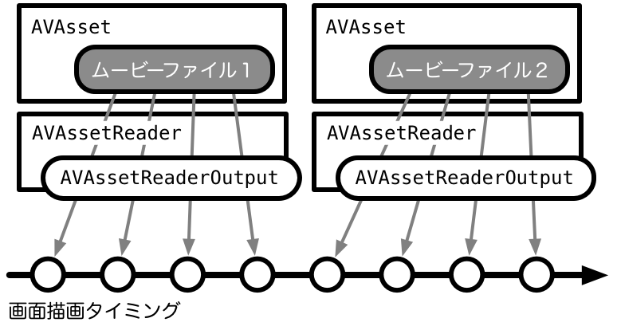
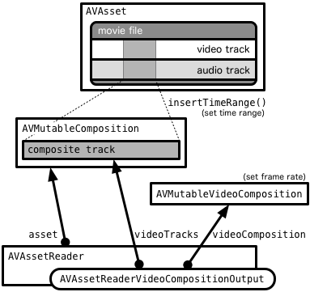

# HKLAVGaplessPlayer

[](http://choosealicense.com/licenses/bsd-3-clause/)
[](https://github.com/Carthage/Carthage)
[](https://gitter.im/katokichisoft/SimpleGaplessPlayer?utm_source=badge&utm_medium=badge&utm_campaign=pr-badge&utm_content=badge)

HKLAVGaplessPlayer is similar Movie player class to AVQueuePlayer. But it can play multiple assets without gap.

## Requirements

iOS 9.3 or later, and Swift 4 or later.

## Installation

### Carthage

HKLAVGaplessPlayer is available through [Carthage](https://github.com/Carthage/Carthage). To install
it, simply add the following line to your Cartfile:

```
github "hirohitokato/SimpleGaplessPlayer"
```

## What is this?

As you know, AVQueuePlayer is used to play a number of items in sequence. But the short gap that we can easily notice them is laid between movies. HKLAVGaplessPlayer plays them with no gap between assets.

The sample app loads video assets from camera-roll (via Photos.framework) when it is launched. Double tap the screen, it plays them with no gap.

This project includes HKLGLPixelBufferView class. It is a subclass of UIView so that you can display video frames.

## Usage

```swift
// Most simple case.

let player = HKLAVGaplessPlayer()
// append assets.
for asset in assets {
  player.appendAsset(asset: asset)
}

// connect playerView(=HKLGLPixelBufferView) to player.
player.delegate = playerView as? HKLAVGaplessPlayerDelegate

// start playing.
player.play(rate: 1.0)
```

## How to remove gaps?

See ViewController.swift. It creates AVAssetReaderVideoCompositionOutput, which is a subclass of AVAssetReader, enables you to read each frames based on the video composition settings.

To play movies continuously, it creates AVAssetReader for each movie. and it generates a frame in each CADisplayLink callback.  Since Current devices' spec is so high, it is enough to play frames on real-time.



However, only generating frames is not good for the gapless player. Because the displaylink callback timing and a framerate of the movie is different. So I use AVAssetReaderVideoCompositionOutput & AVMutableVideoComposition instead of AVAssetReader. They enable us to set output frame interval as we like.



This is the way how to remove gaps.

## Current Limitation

HKLAVGaplessPlayer currently supports only video tracks. Audio is not supported yet.(TODO)

## License
SimpleGaplessPlayer is published under New BSD License

## Special Thanks

- [Norio Nomura](https://github.com/norio-nomura)
